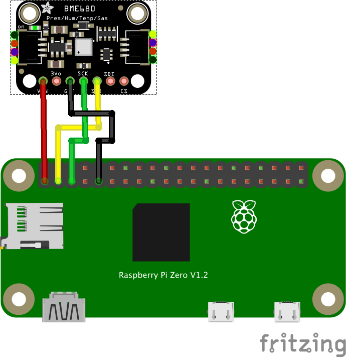

= BME680-Exporter

image:https://img.shields.io/docker/pulls/dubhar/bme680_exporter?logo=docker&style=flat[link="https://hub.docker.com/r/dubhar/bme680_exporter"]
image:https://img.shields.io/docker/v/dubhar/bme680_exporter?sort=semver&style=flat[link="https://hub.docker.com/r/dubhar/bme680_exporter"]
image:https://img.shields.io/docker/image-size/dubhar/bme680_exporter/latest?label=image%20size%20%28latest%20%22docker%22%29&logo=docker[asdf]
image:https://img.shields.io/github/license/dubhar/bme680_exporter[link="https://github.com/dubhar/bme680_exporter/blob/develop/LICENSE"]
image:https://snyk.io/test/github/dubhar/bme680_exporter/badge.svg[Vulnerabilities]


== How to wire the sensor
Here is a wiring diagram of an Adafruit BME680 breakout board and a Raspberry Pi Zero. Of course there are many other breakout board manufacturers and you should pay attention to their respective pinouts, see datasheets and or silkscreend text. Also you can use more than just a Raspberry Pi, basically every computer with I²C bus that is capable of running docker is sufficient. So the diagram is for examplary purposes only



== How to setup the Docker container
For testing purposes it is suggested to run the container interactively, like so:
```
docker run -it -p 9100:9100 -e LOCATION="Bedroom" -e I2C_ADDRESS="0x76" --device /dev/i2c-1:/dev/i2c-1 dubhar/bme680_exporter:latest
```
For production it is recommended to use an orchestration tool like Kubernetes or docker-compose. Here is an example configuration for docker-compose:
```
version: "3.7"

services:
  bme680_exporter:
    image: dubhar/bme680_exporter:latest
    expose:
      - 9100
    devices:
      - "/dev/i2c-1:/dev/i2c-1"
    environment:
      LOCATION: "LivingRoom"
      I2C_ADDRESS: "0x76"
    restart: always
```

== Settings

At the moment you can (and probably should) adjust the following things:

[cols="1,1"]
|===
|Setting | Description

| ENV['LOCATION'] | A label that describes the sensor location, solely for display purposes. Default="home"
| ENV['I2C_ADDRESS'] | The I²C address of the BME680 sensor. Default=0x77
| devices['/dev/i2c-1'] | Mapping of the I²C bus on the host (may be different than "-1") to the I²C bus used inside the container (must be "i2c-1")
| ports['9100'] | Port that the exporter is listening to, adjust so that each exporter has its unique port
|===

== Prometheus

Here is a snippet of a `prometheus.yml` configuration
```
[...]
  - job_name: 'bme680'
    static_configs:
      - targets: ['bme680_exporter:9100']
```

== Grafana

Here are some queries as starting point. Adjust them and make yourself a dashboard that suits you!

```
# simplest queries
current_temperature{}

# queries with location filters
current_humidity{location="LivingRoom"}
current_air_pressure{location="Basement"}
current_gas_resistance{location="Basement"}

# queries with calculations (adjust pressure for temperature and measurement altitude of 186m)
(current_air_pressure{location="Basement"} * (1.0 - ((0.0065*186.0) / (current_temperature{location="Basement"} + (0.0065 * 186.0) + 273.15)))^-5.257 )
```

